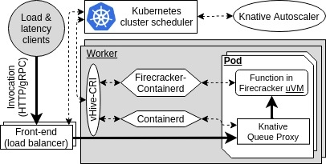

## Mission

vHive aims to enable serverless systems researchers to innovate across the deep and distributed software stacks
of a modern serverless platform. Hence, we built vHive to be representative of the leading
Function-as-a-Service (FaaS) providers, integrating the same production-grade components used by the providers, including
[AWS Firecracker hypervisor](https://firecracker-microvm.github.io/),
Cloud Native Computing Foundation's [Containerd](https://containerd.io/),
and [Kubernetes](https://kubernetes.io/).

vHive adopts [Knative's]() flexible programming model, allowing the researchers to quickly deploy
and experiment with *any* serverless applications that may comprise many functions,
running in secure Firecracker microVMs, as well as serverfull services.
Both the functions and the stateful services can be deployed using OCI/Docker images.

vHive empowers systems researchers to innovate on key serverless features,
including functions autoscaling and cold-start delay optimization with several snapshotting mechanisms.

## vHive architecture

## Referencing our work

If you decide to use vHive for your research and experiments, we are thrilled to support you by offering
advice for potential extensions of vHive and always open for collaboration.

Please cite our paper that has been recently accepted to ASPLOS 2021, available by [TBD]().

## Getting started with vHive

vHive can be readily deployed on premises or in cloud, with support for nested virtualization.
We provide [a quick-start guide](https://github.com/ease-lab/vhive/wiki/Getting-started-with-vHive-(on-CloudLab))
that describes how to set up an experiment on CloudLab however we anticipate no issue for other settings.

## Developing vHive

### Getting help and contributing

We would be happy to answer any questions in GitHub Issues and encourage the open-source community
to submit new Issues, assist in addressing existing issues and limitations, and contribute their code with Pull Requests.

To guarantee high code quality and reliability, we deploy fully automated CI
on cloud and self-hosted runners with GitHub Actions (upon commits and PRs) and Travis CI (nightly testing).

### License and copyright

vHive is free. We publish the code under the terms of the MIT License that allows distribution, modification, and commercial use.
This software, however, comes without any warranty or liability.

The software is developed at the [EASE lab](https://easelab.inf.ed.ac.uk/) in the University of Edinburgh.

### Maintainers

* [Dmitrii Ustiugov](https://github.com/ustiugov)
* [Plamen Petrov](https://github.com/plamenmpetrov)

